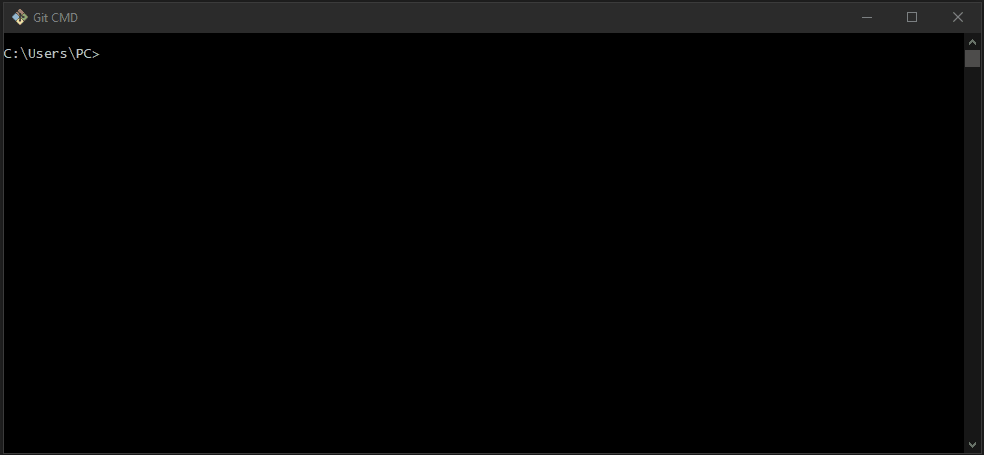

<h1 align="center">
  
</h1>

<h3 align="justify">
Academic demonstration of Git customization via CMD in order to delete and update the email, for example. Requirement for Commit. Credits for Digital Innovation One's Git and GitHub module.
</h3>

 

## 📷 Demonstration

  

 

## 🚀 Technologies

This project was developed with the following technologies:

- Git

 

## ⚙ Settings
- https://git-scm.com/book/en/v2/Getting-Started-Installing-Git
- git config --list
- git config --global --unset user.email
- git config --global user.email "new email"
 

---

Made with 💜 by Rafael Maciel
